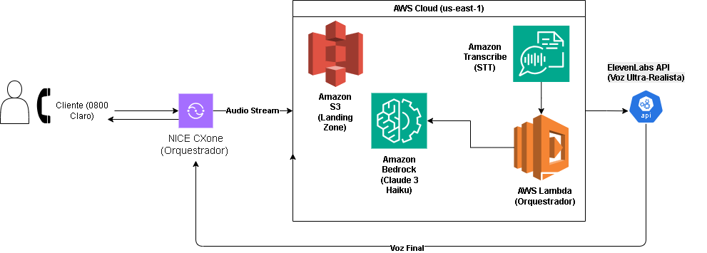

# 📞 AVI Claro - Simulador de Voz com IA Ultra-Realista (POC)

O **AVI (Assistente Virtual Inteligente)** é uma Prova de Conceito (POC) desenvolvida para otimizar o atendimento de pós-venda da **Claro Brasil**. O sistema utiliza Inteligência Artificial Generativa e síntese de voz de alta fidelidade para humanizar o autoatendimento e resolver demandas críticas com agilidade.

---

## 🏗️ Arquitetura da Solução



O sistema utiliza uma abordagem de IA Generativa Multimodal integrada ao **NICE CXone** para substituir o fluxo de URAs tradicionais por uma interface de conversação natural.

### 🧱 Fluxo de Dados (End-to-End)

1.  **Captura:** Interface Streamlit (ou NICE CXone via WebSocket) captura o áudio do cliente em formato de alta qualidade.
2.  **Ingestão:** O áudio é armazenado no **Amazon S3** (`audio-claro-poc-andy`), servindo como *landing zone* para auditoria e processamento.
3.  **Transcrição (STT):** O **Amazon Transcribe** converte a fala em texto em tempo real, suportando as nuances do português (PT-BR).
4.  **Orquestração (AWS Lambda):** Camada *serverless* responsável pelo pré-processamento, consulta a APIs legadas da Claro (ex: status de pedido/CPF) e formatação dinâmica de prompts.
5.  **Cérebro (LLM):** O **Amazon Bedrock (Claude 3 Haiku)** processa o contexto, aplica as regras de negócio e gera a resposta resolutiva.
6.  **Síntese (TTS):** A **ElevenLabs** converte o texto final em uma voz ultra-realista que é reproduzida para o cliente.

---

## ☁️ Infraestrutura Cloud (AWS)

* **Segurança:** Utilização de **IAM Roles** com permissões granulares e remoção de *Permissions Boundaries* restritivas para garantir a fluidez e integridade do processo.
* **Escalabilidade:** Arquitetura 100% preparada para lidar com altos volumes de chamadas simultâneas através de serviços *serverless* e orquestração via Lambda.

---

## 🚀 Diferenciais Técnicos

* **Experiência Premium:** Substituição de vozes sintéticas tradicionais por IA de voz ultra-realista, reduzindo drasticamente o esforço cognitivo do cliente.
* **Inteligência de Pós-Venda:** Mapeamento de intenções estratégicas para logística (rastreio de iPhones), suporte técnico e protocolos de segurança.
* **Resiliência:** Sistema robusto com *fallback* para entrada de texto em casos de limitações de hardware ou rede.

---

## 🛠️ Tecnologias Utilizadas

* **Linguagem:** Python 3.11+
* **Orquestração:** AWS Lambda (Serverless)
* **IA & Infraestrutura:** AWS (S3, Transcribe, Bedrock)
* **Voz (High-Fidelity):** ElevenLabs
* **Interface de Testes:** Streamlit

---

## 📦 Como Rodar o Projeto Localmente

1.  **Clone o repositório:**
    ```bash
    git clone [https://github.com/aclaymar/poc-voice-ia-claro.git](https://github.com/aclaymar/poc-voice-ia-claro.git)
    cd poc-voice-ia-claro
    ```